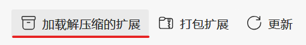
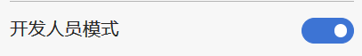
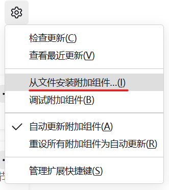

# 卫生成绩录入助手

自动登录卫生成绩录入页面并帮助完成卫生成绩录入的插件

## 安装

### Chrome/Edge

1. 在Release页面[下载对应浏览器的最新版本](https://github.com/SunnyCloudYang/DormScoreRegister/releases)或在Code页面[下载压缩包](https://github.com/SunnyCloudYang/DormScoreRegister)（仅限Chrome内核的浏览器），然后解压到任意一个文件夹。
2. 打开 Chrome/Edge的扩展页面（Chrome是 `chrome://extensions/` ，Edge是 `edge://extensions/`），点击 `加载解压缩的插件` 并选择你刚刚解压的文件夹（**记得在加载前打开`开发人员模式`!**），完成安装。
   
   

### Firefox

1. 在Release页面[下载对应浏览器的最新版本](https://github.com/SunnyCloudYang/DormScoreRegister/releases)（后缀为.xpi的那个），保存到任意文件夹。
2. 打开FireFox的扩展页面（`about:addons`），点击齿轮图标，选择 `从文件安装附加组件`，选择刚刚下载的文件，完成安装。（同样需要打开`开发者模式`）
   

## 获取更新

删除插件后重新下载最新版本安装即可。

## 功能

- [x] 自动登录到选中楼层的等级录入页面
- [x] 自动填写等级（默认为 A）
- [x] 自动生成整改意见
- [x] 支持快捷键和下拉框选择等级
- [x] 避免了添加错误的意见
- [x] 自动登录并导出该楼全部卫生成绩

## 使用方法

### 成绩录入（层长）

1. 单击扩展图标，**打开开关**启用扩展。（开关会记忆状态，只需打开一次）
2. **点击`进入系统`** 进入登录页面。
3. **选择录入的区域、楼号和楼层以及密码后缀**，点击`开始录入`按钮进入评分录入页面。
4. 稍等片刻，扩展会自动选择“按房间录入成绩”并填写楼层和起始房间号，只需**点击 `去录入` 按钮**即可开始录入分数。
5. 新的房间页面加载完成时，**点击左边栏中的 `填充`按钮**，填充默认分数并自动填写默认建议。
6. **`右击`**下拉框，可将评分更改为 **"B"**； **`Ctrl+右击`**，可将评分改为 **"C"**；**`Shift+右击`** 改为 **"D"**。
7. 无论通过快捷键还是下拉框选择分数等级，整改建议都将自动生成和调整，不需要额外操作。
8. **点击`保存`按钮** 保存并进入下一个房间。（这里禁用了`下一个房间`按钮，旧版也是如此，我也不知道为什么）

### 成绩导出（楼长）

1. 单击扩展图标，**打开开关**启用扩展。（开关会记忆状态，只需打开一次）
2. **点击`进入系统`** 进入登录页面。
3. 选择想要导出的**区域**和**楼号**，点击`去导出`按钮，等待浏览器自动导出并下载全楼成绩。

**注意：** 插件会自动登录每一层的页面并下载导出csv文件，不需要额外操作，导出每层大概需要2~5秒，直到弹框显示没有这个用户名即为全部导出完毕。

## 获取更新

1. 如果是使用Git安装的，直接 `git pull` 即可
2. 如果是使用压缩包安装的，删除原来的插件，重新安装即可
3. 如果是使用Firefox安装的，进入插件管理页面，点击 `更新` 按钮，完成更新。（或删除插件后重新安装）

## 已知问题

- [ ] 有时无法自动进入 "按房间录入卫生成绩"，刷新页面即可。
- [ ] 由于没有注册为开发者，因此每两个星期浏览器会提醒你关闭开发人员模式下的扩展，选择两周后提醒即可。（稍微有点烦人，后续可能会移植到油猴脚本或者发布到应用商店）

## 声明

- 本扩展仅为学习研究，对使用本扩展所造成的任何后果概不负责。
- 本扩展仅适用于**清华大学**宿舍卫生评分录入页面，非授权用户请勿使用。

## 问题反馈

如果你有任何问题或建议，欢迎在[Issues](https://github.com/SunnyCloudYang/DormScoreRegister/issues)中提出或者直接邮件[联系我](mailto:sunnycloudyang@outlook.com)。

## 更新日志

### v3.3.1

#### 修复

- 修复了自动填充失效的问题
- 修复插件启用开关逻辑

### v3.3.0

#### 功能

- 支持从WEBVPN登录
- 新房间自动填充

#### 修复

- 修复了获取更新的逻辑

### v3.2.3

#### 修复

- 修复特定情况下无法添加填充按钮问题
- 添加南10北楼

### v3.2.2

#### 功能

- 支持补录入页面
- 退出前弹窗确认避免误操作
- 优化获取更新的稳定性

### v3.1.0

#### 修复

- 匹配https

### v3.0.0

#### 功能

- 支持自动导出卫生成绩
- 自动检查有无更新

### v2.1.1

#### 修复

- 添加了南区缺少的楼号

### v2.1.0

#### 功能

- 支持选择密码后缀

#### 修复

- 修复了建议生成的格式

### v2.0.0

- 更新密码模式

### v1.1.4

#### 功能

- 支持Firefox

### v1.0.0

- 第一版发布

#### 功能

- 自动登录
- 自动填写评分
- 自动生成建议
